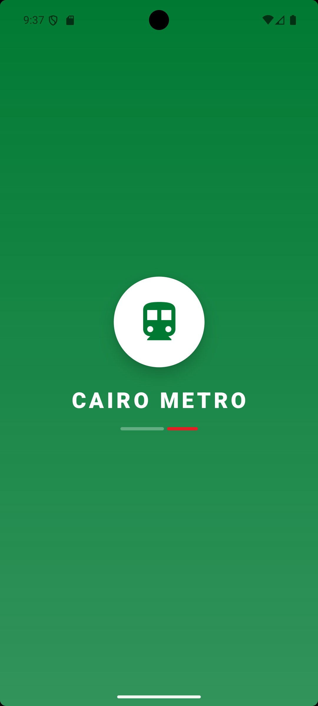
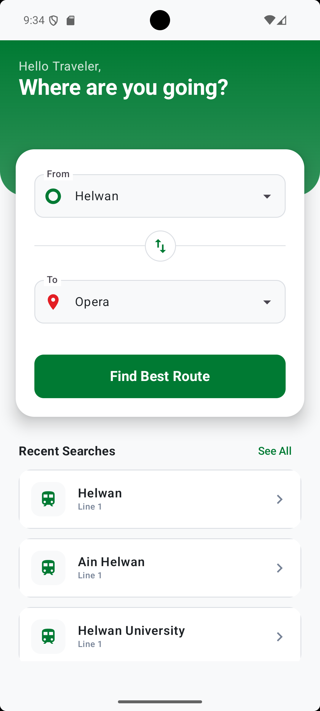
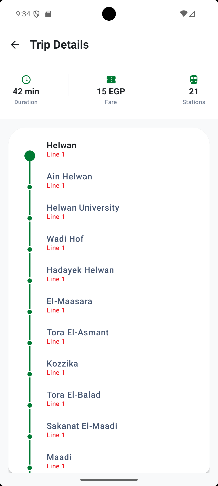

# 🚇 Cairo Metro App

A modern Android application that helps users find the best route between metro stations in Cairo with ease and efficiency.

---

## 📱 Overview

**Cairo Metro App** allows users to select a starting station and destination, then provides all the necessary trip details in a simple and user-friendly way.

This project focuses on applying **Clean Architecture**, **MVVM**, and modern Android development practices using **Jetpack Compose**.

---

## ✨ Features

- 🔍 **Find the best route** between two stations  
- 📍 **Calculate number of stations**  
- ⏱️ **Estimate travel time**  
- 💰 **Show ticket price**  
- 🔄 **Detect metro line transitions (transfers)**  
- 🎨 **Clean and modern UI** built with Jetpack Compose  

---

## 🧠 Architecture

This project follows **Clean Architecture** with separation of concerns:

- **Data Layer** – Handles data sources (local JSON) and repository implementations  
- **Domain Layer** – Contains business logic and use cases  
- **Presentation Layer** – Includes ViewModels and UI built with Jetpack Compose  

**Note:** In Jetpack Compose, UI is part of the presentation layer.

---

## 🛠️ Tech Stack

- **Kotlin**  
- **Jetpack Compose**  
- **MVVM Architecture**  
- **Clean Architecture**  
- **Coroutines**  
- **JSON (Local Data Source)**  

---

## 📸 Screenshots

   
   
  

---

## 🎥 Demo Video

Check out the **LinkedIn post** for a demo video:  
👉 [Watch Demo Video](https://www.linkedin.com/posts/mostafa-tahoon66_androiddevelopment-mobiledevelopment-kotlin-ugcPost-7443006507216003073-DJ7b?utm_source=share&utm_medium=member_desktop&rcm=ACoAADqi01MB-K5NVlbA-5KZYKYpz3jdvSlW44U)

---

## 🚀 Getting Started

1. Clone the repository:
git clone https://github.com/mostafatahoon/MetroCairo.git
2. Open in Android Studio  
3. Run the project on an emulator or real device  

---

## 🎯 What I Learned

- Applying **Clean Architecture** in a real project  
- Building UI using **Jetpack Compose**  
- Managing **UI state with ViewModel**  
- Structuring **scalable Android applications**  
- Solving **real-world navigation problems**  

---

## 📌 Future Improvements

- Add real-time data (API integration)  
- Improve UI/UX animations  
- Add offline caching & database  
- Support multiple languages  

---

## 🤝 Contributing

Feel free to fork this project or open issues for suggestions and improvements.

---

## 📬 Contact
Feel free to fork this project or open issues for suggestions and improvements.
📧 Email: **mostafa.tahoon66@gmail.com**  
🔗 LinkedIn: [Connect with me](https://www.linkedin.com/in/mostafa-tahoon66)
---

⭐ If you like this project, consider giving it a star!
